# Activity Diagram — Generate Itinerary

Alur lengkap dari user mengisi form sampai itinerary tersimpan. Dua decision node bertanda DECISION mencegah input tidak valid dan respons AI yang tidak memenuhi kontrak masuk ke database — sesuai rancangan pada slide Activity Diagram.

```mermaid
flowchart TD
    mulai((" ")) --> isiForm["User mengisi form preferensi<br/>tujuan, tanggal, budget, minat, gaya"]

    isiForm --> pakaiLokasi{"Pakai tombol<br/>lokasi saya?"}
    pakaiLokasi -->|Ya| geolocation["Browser minta izin lokasi<br/>lalu reverse geocode jadi nama kota"]
    geolocation --> izinOk{"Izin<br/>diberikan?"}
    izinOk -->|Ya| isiOtomatis["Field kota asal terisi otomatis"]
    izinOk -->|Tidak| ketikManual["Tampilkan pesan ramah<br/>kota asal diketik manual"]
    isiOtomatis --> submit
    ketikManual --> submit
    pakaiLokasi -->|Tidak| submit["User menekan Susun Itinerary"]

    submit --> validasiInput{"DECISION 1<br/>Input valid?<br/>tanggal, durasi 1-14 hari,<br/>budget, jumlah wisatawan"}
    validasiInput -->|Tidak| error400["Balas 400<br/>tampilkan pesan kesalahan"]
    error400 --> isiForm

    validasiInput -->|Ya| simpanTrip["Simpan trip status draft<br/>dan preferensi ke database"]
    simpanTrip --> bangunPrompt["Susun prompt dari data trip"]
    bangunPrompt --> panggilAi["Panggil Gemini<br/>responseMimeType JSON + responseSchema"]

    panggilAi --> aiError{"Gemini<br/>error?"}
    aiError -->|Ya| terjemahkan["Terjemahkan error jadi bahasa manusia<br/>kuota habis / server ramai / koneksi"]
    terjemahkan --> tandaiGagal

    aiError -->|Tidak| validasiJson{"DECISION 2<br/>Kontrak JSON lolos?<br/>jumlah hari sesuai, tiap hari ada<br/>aktivitas, tiap aktivitas ada nama"}

    validasiJson -->|Tidak| cekPercobaan{"Percobaan<br/>masih kurang dari 2?"}
    cekPercobaan -->|Ya| promptPerbaikan["Susun ulang prompt<br/>lampirkan daftar kesalahannya"]
    promptPerbaikan --> panggilAi
    cekPercobaan -->|Tidak| tandaiGagal["Simpan trip status failed<br/>beserta pesan yang bisa dibaca user"]
    tandaiGagal --> tawarkanUlang["Kartu trip menampilkan tombol Coba lagi<br/>isian form tidak hilang"]
    tawarkanUlang --> selesaiGagal((("Gagal")))

    validasiJson -->|Ya| normalisasi["Normalisasi data<br/>kategori asing jadi lainnya, jam ngawur jadi null,<br/>koordinat mustahil dibuang, urutkan hari 1..n"]

    normalisasi --> loopTempat["Untuk tiap aktivitas non-transport<br/>cari lokasinya ke Nominatim<br/>antrean 1 permintaan per detik"]
    loopTempat --> ketemu{"Tempat ketemu<br/>di OpenStreetMap?"}
    ketemu -->|Ya| pakaiOsm["Pakai koordinat OSM<br/>placeVerified = true"]
    ketemu -->|Tidak| pakaiAi["Pakai koordinat tebakan AI bila ada<br/>placeVerified = false, diberi lencana peringatan"]

    pakaiOsm --> hitungJarak
    pakaiAi --> hitungJarak["Hitung jarak antar aktivitas per hari<br/>rumus haversine, lalu estimasi waktu tempuh"]

    hitungJarak --> transaksi["Buka transaksi database"]
    transaksi --> simpanVersi["Simpan sebagai versi baru<br/>itinerary, hari, aktivitas"]
    simpanVersi --> transaksiOk{"Transaksi<br/>berhasil?"}
    transaksiOk -->|Tidak| rollback["Rollback penuh<br/>tidak ada itinerary setengah jadi"]
    rollback --> tandaiGagal
    transaksiOk -->|Ya| tandaiSukses["Ubah status trip jadi generated"]
    tandaiSukses --> tampilkan["Arahkan ke halaman detail<br/>itinerary per hari dan peta Leaflet"]
    tampilkan --> selesai((("Selesai")))

    classDef keputusan fill:#FEF3C7,stroke:#D97706,stroke-width:2px,color:#78350F
    classDef aksi fill:#FFFFFF,stroke:#64748B,stroke-width:1.5px,color:#1F2937
    classDef gagal fill:#FEE2E2,stroke:#DC2626,stroke-width:2px,color:#7F1D1D
    classDef sukses fill:#D1FAE5,stroke:#059669,stroke-width:2px,color:#064E3B
    classDef ai fill:#EDE9FE,stroke:#7C3AED,stroke-width:2px,color:#4C1D95

    class validasiInput,validasiJson,pakaiLokasi,izinOk,aiError,cekPercobaan,ketemu,transaksiOk keputusan
    class error400,tandaiGagal,rollback,tawarkanUlang,terjemahkan gagal
    class tandaiSukses,tampilkan sukses
    class panggilAi,bangunPrompt,promptPerbaikan ai
```

