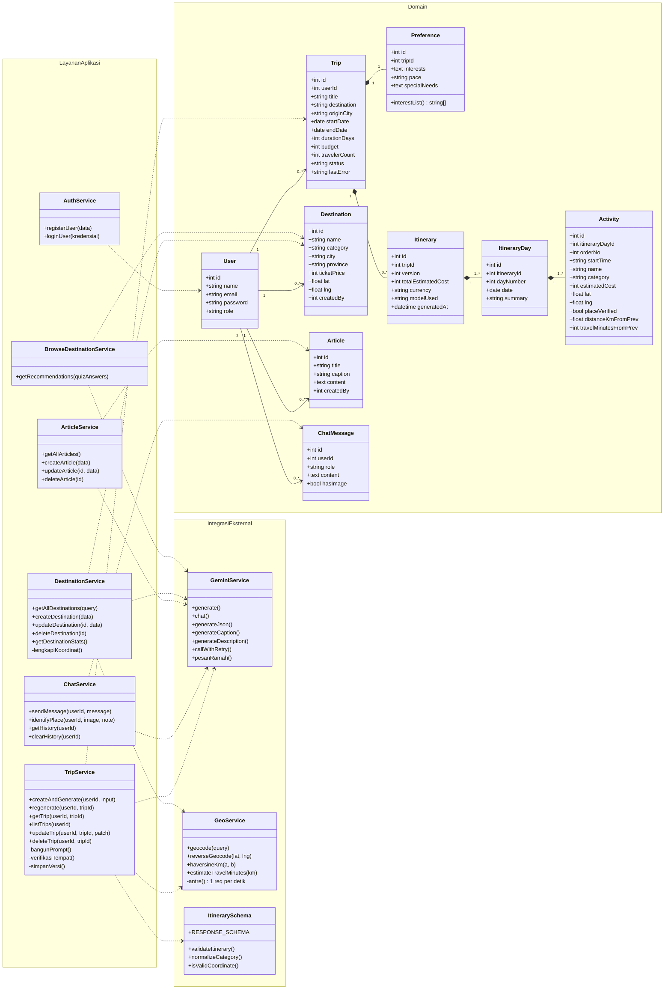

# Class Diagram — TrAvelIt

Struktur kelas dipisah tiga namespace: Domain (entitas database), Layanan Aplikasi (logika bisnis), dan Integrasi Eksternal (AI, peta, validator). Belah ketupat penuh menandai komposisi: Trip → Itinerary → ItineraryDay → Activity.

